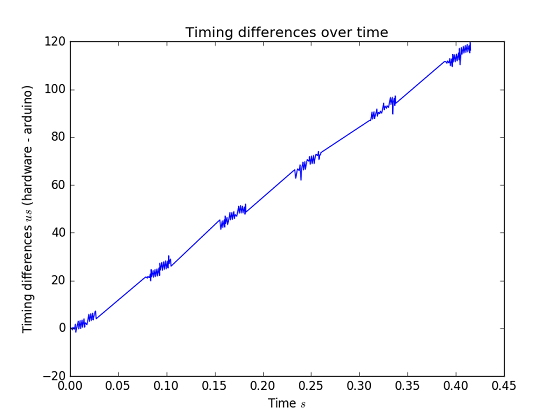
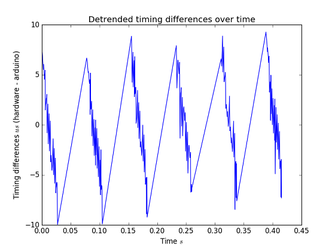

# DigitalScope - Library

A collection of routines for recording events from digital input pins. It turns
your Arduino into a software logic analyzer. Carefully designed maximizing capture performance.

## Usage

Use a scope to record digital events during a fixed time period after a trigger
condition is met.

Include the library and configure a new scope.

```c++
// Include library
#include <DigitalScope.h>

// Initalize a new scope with max number of events 
// to collect (128) and target pin (2)
typedef scopes::DigitalScope<128, 2> Scope;
```

**DigitalScope** uses interrupt service routines to free your code from unnecessary polling. You can use callbacks on certain events to upate your main loop.

```c++

// Will be used to signal begin of event detection. 
volatile bool started = false;

void setup()
{
    started = false;

    // Used for outputting captured values.
    Serial.begin(9600);
    while(!Serial) {}

    // Set a callback function to be invoked when data recording has begun. 
    scope.setBeginCallback(onBegin);

    // Start recording when we observe the first falling edge.
    scope.start(FALLING);
}
```

The callback function simply sets the `started` flag as shown below

```c++
void onBegin() 
{
    // Signal loop() that first event was recorded.
    started = true;
}
```

Finally in `loop()` we pause for 1 second once first event was observed and output all events captured during this period via the Serial interface.

```c++
void loop()
{
    if (started) {

        // Sleep for a second. 
        // Scope will continue to record data meanwhile.
        delay(1000);
        
        // Stop recording
        scope.stop();

        Serial.println("BEGIN DATA");

        const uint16_t nEvents = scope.numEvents();        
        for (uint16_t i = 0; i < nEvents; ++i)
        {
            // Print event time in microseconds since first event, 
            // event type RISING/FALLING and
            // resulting event state HIGH/LOW

            Serial.print(scope.timeOf(i)); Serial.print(" ");            
            Serial.print(scope.eventOf(i)); Serial.print(" ");
            Serial.print(scope.stateOf(i));

            Serial.println();
        }

        Serial.println("END DATA");

        // Restart the scope after a short pause.

        delay(5000);        
        started = false;
        scope.start(FALLING);
        Serial.println("LOG Ready for capture");
    }
}
```

More examples can be found in the [examples](examples/) directory.

## Accuracy

### tl;tr
In general we conclude that **DigitalScope** is off by `55us` after `180ms`. 

### Setup

**DigitalScope** was developed for recording IR signals sent out by remotes operating at 38kHz. The following findings are based on differences of event arrival times reported between two systems. The first system consists of an hardware logic analyzer (Saleae Logic 4) and the second one is a Arduino Uno R3 running **DigitalScope** (program compiled with `-O3`). 

### Data
All data was captured simulateously for both systems and stems from a TSOP3848 IR receiver. The comparison below consists of 216 events captured during a period of `0.41` seconds. This corresponds to 6 IR bursts with 5 pauses of roughly `50`ms each.

### Evaluation

The image below shows the signed timing differences between events. The x-axis is the time axis, the y-axis shows the signed difference of event arrival between hardware and Arduino.



Note how differences increase linearly with recording time. The six zigzags correspond to data bursts sent from an IR remote. The straight lines in between indicate pauses.

Since the timing differences in pauses increase as well (i.e ISR is not invoked because no edge events occur), we conclude this effect can be attributed to the inaccuracy of the Arduino clock. In particular: this Arduino is running slow.

This is no suprise. The clock of the Arduino Uno isn't the most accurate. [This](http://forum.arduino.cc/index.php?topic=13289.0) and [this](http://forum.arduino.cc/index.php?topic=89784.0) thread shed light on the Arduino Uno R3's clock. It consists of ceramic resonantor and not a quartz crystal. Typical errors of ceramic resonators range are around `0.5%` or `5000ppm`. `5000ppm` specifies that the allowed tolerated deviation from a nominal clock value is ~ +/- `900us` in every `180ms`. In contrast the [accuracy](http://support.saleae.com/hc/en-us/articles/208667166-Measurement-Error-Logic-timing-digital-pulse-width-) of the logic analyzer is `50ppm` or `0.005%`. This is considerably more accurate (which is why we trust the hardware in this comparison :)

By talking out the linear trend in the above image we get



During periods of rapid event arrival the time differences turn around, leading to the conclusion that **DigitalScope** detects events slightly later, due to processing time or different digital voltage thresholds on both systems.

In case you are eager to reproduce the above findings have a look at [etc/timing_data](etc/timing_data).